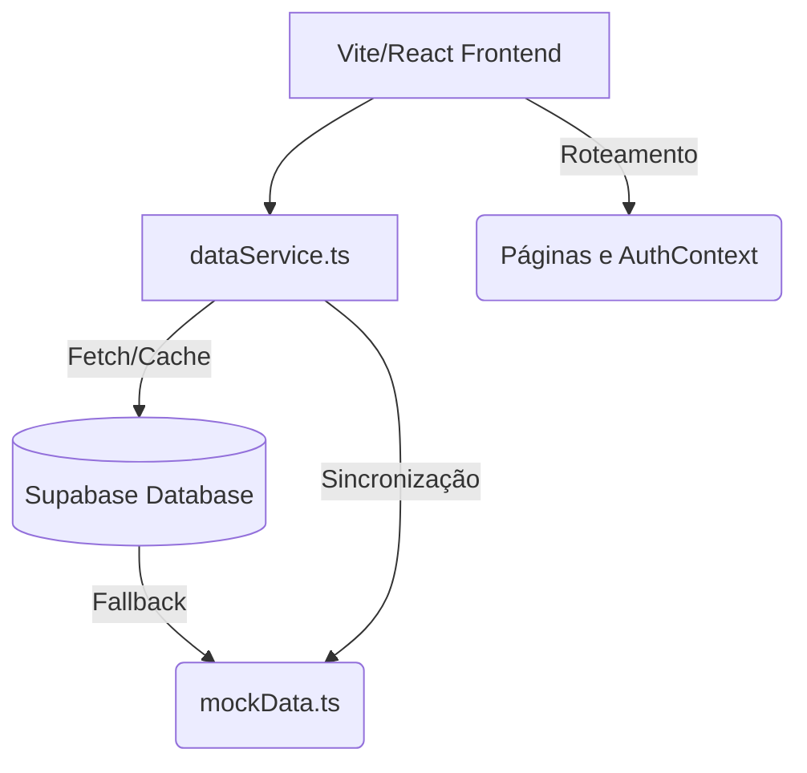

# Arquitetura

Este documento detalha o stack tecnológico e a arquitetura central do Atlas Fármaco.

## Stack Tecnológico

As versões abaixo refletem o `package.json` atual:
- **Framework & Build:** React 19.0.1 + Vite 6.2.3
- **Runtime:** Node.js (via Vercel e scripts locais TS)
- **Gerenciador de Pacotes:** npm
- **Roteamento:** React Router DOM 7.15.0
- **Estilização:** TailwindCSS 4.1.14 (`@tailwindcss/vite`) e Lucide React para ícones.
- **Gráficos & Visualização:** `react-force-graph-2d` 1.29.1 e `d3-force` 3.0.0.
- **Animações:** `motion` 12.23.24
- **Integração Backend/Auth:** Supabase-js 2.106.1

## Árvore de Diretórios

- `/src/components`: Componentes React reutilizáveis (Layout, Visualizadores, Painéis).
- `/src/pages`: Rotas principais da aplicação (Dashboard, Molecules, Receptors, etc). Proteção de rotas premium via `<ProtectedRoute>`.
- `/src/data`: Definição de Schemas TypeScript e mock de fallback (`mockData.ts`).
- `/src/services`: Serviço de conexão de dados e inicialização de cliente Supabase.
- `/src/context`: Contextos globais React, como `AuthContext`.
- `/scripts`: Scripts Node de uso interno para rodar DDLs e Seeders no banco de dados.
- `/public`: Assets estáticos.

## Fluxo de Dados

A arquitetura de dados obedece um padrão Single-Source-of-Truth externo:
1. **App Mount:** O React App monta e dispara `dataService.loadData()`.
2. **Fetch:** O `dataService` puxa tabelas inteiras do Supabase (molecules, receptors, enzymes, etc).
3. **Fallback:** Dados que não retornam ou falham puxam fallback do arquivo `mockData.ts`.
4. **State Local:** O `dataService` mantém as entidades cacheadas na memória. Páginas consultam funções get (ex: `getMolecules()`).

## Diagrama Principal

## Integrações Externas
- **Supabase**: Provedor de Banco de Dados Postgres em nuvem e Autenticação (SaaS). Usado de forma central via REST API (supabase-js).
- **Vercel**: Hospedagem frontend, sem serverless functions ativas configuradas explicitamente (tudo servido via Vite app).
